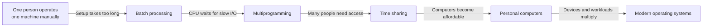
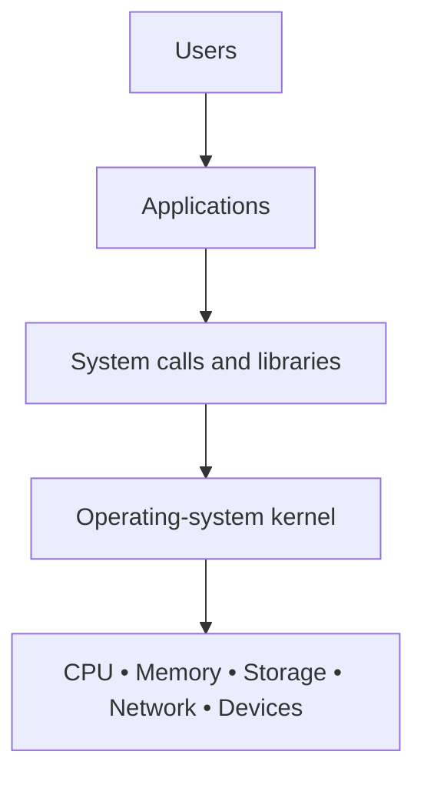

# Lecture 1: Introduction to Operating Systems

> **Central question:** Why does a computer need an operating system?

## Learning objectives

By the end of this lecture, you should be able to:

- describe a computer as a programmable machine that accepts input, processes data, stores information, and produces output;
- explain how early computers were programmed and operated;
- connect batch processing, multiprogramming, and time sharing to the problems they were designed to solve;
- distinguish a program, a process, and an operating system; and
- identify the major resources managed by a modern operating system.

## The story in one picture



The history of operating systems is a history of bottlenecks. Each new style of operating system appeared because the previous way of using a computer wasted an expensive resource or made the machine too difficult to share.

---

## 1. What is a computer?

A **modern digital computer** is an electronic, programmable machine. It follows stored instructions to transform input data into useful output. Earlier calculating devices could be manual, mechanical, or electromechanical rather than fully electronic.

Every general-purpose computer can be understood through four basic activities:

1. **Input** — receiving data and instructions.
2. **Processing** — performing arithmetic, comparisons, and control operations.
3. **Storage** — retaining instructions, intermediate results, and files.
4. **Output** — presenting or transmitting results.

The physical components are called **hardware**. Programs and data are called **software**. Hardware can execute only very small, precisely encoded instructions; software combines those instructions into useful tasks.

A **program** is a passive set of stored instructions. A **process** is a running instance of a program, together with its current execution state and assigned resources. One program can therefore produce several processes—for example, opening two instances of the same application.

> **Key idea:** A computer is not intelligent merely because it is electronic. It becomes useful when people can describe a procedure precisely enough for the machine to execute it.

## 2. Why were computers created?

Humans have always calculated: counting goods, measuring land, tracking taxes, navigating, and predicting astronomical events. Manual calculation is slow and vulnerable to fatigue and transcription errors. Mechanical and electronic computers were created to make repeated calculations faster, more consistent, and more scalable.

Important early motivations included:

- scientific tables and engineering calculations;
- census and business-record processing;
- navigation and astronomy;
- codebreaking and military calculations; and
- automation of repetitive office work.

The word *computer* originally described a person who performed calculations. Over time, the machines took the name of the occupation.

## 3. Early computing machines

The path to the modern computer included several kinds of machines:

| Period | Example | Main contribution |
|---|---|---|
| Ancient era | Abacus | A physical aid for representing and manipulating numbers |
| 1600s–1800s | Mechanical calculators | Gears performed arithmetic operations |
| 1800s | Jacquard loom and Hollerith tabulator | Punched media represented instructions or data |
| 1930s–1940s | Electromechanical computers | Relays automated sequences of operations |
| 1940s onward | Electronic digital computers | Vacuum tubes, then transistors and integrated circuits, greatly increased speed |

ENIAC, completed in the 1940s, is a useful example of an early general-purpose electronic digital computer. It filled a room and was operated through panels, switches, cables, and other equipment.


*Figure 1. ENIAC at the Moore School of Electrical Engineering, 1946. U.S. Army Photo; public domain in the United States. [Source and reuse details](https://commons.wikimedia.org/wiki/File:Classic_shot_of_the_ENIAC.jpg).*

Early machines were expensive, physically large, and difficult to operate. A user could not simply sit down, click an icon, and run a program. Preparing the machine was itself a major part of the work. [MIT's operating-systems history notes](https://people.csail.mit.edu/rinard/teaching/osnotes/h1.html) emphasize how the changing relative costs of people and hardware shaped this evolution.

## 4. How did humans give instructions?

### Switches and plugboards

On some early computers, an operator entered values or selected operations using switches. Programming could also require reconnecting cables on plugboards. This made setup slow and error-prone, but the controls exposed the machine's operation directly.

### Punched cards

A punched card stored information as a pattern of holes. A card reader sensed the holes and converted them into electrical signals. A single card commonly represented one line of data or program text, so a substantial program could require a carefully ordered deck.


*Figure 2. An 80-column punched card. Photo by Mutatis mutandis, used under [CC BY-SA 3.0](https://creativecommons.org/licenses/by-sa/3.0/). [Source](https://commons.wikimedia.org/wiki/File:Punched_card.jpg).*

If the deck was dropped and the cards were not numbered, restoring the correct order could be a serious problem.

### Paper tape

Paper tape encoded characters as rows of holes along a continuous strip. It could carry a program or data and could be produced by a keyboard-operated punch. Compared with switches, paper media made a program easier to store, transport, and run again.


*Figure 3. Fan-fold paper tape used with early computers. Photo by Poil, used under [CC BY-SA 3.0](https://creativecommons.org/licenses/by-sa/3.0/). [Source](https://commons.wikimedia.org/wiki/File:Papertape.jpg).*

### Other input methods

Early systems also accepted input through:

- magnetic tape read by a tape drive;
- typewriters and teleprinters;
- card punches and card readers;
- paper-tape readers; and
- front-panel buttons and switches.

These methods were not merely accessories. Programs often had to control each device in a machine-specific way.

## 5. How did the computer produce output?

### Printers

Before monitors became common, printed paper was the main human-readable output. High-speed **line printers** printed an entire line at once and were well suited to reports, bills, payroll, and program listings.


*Figure 4. An IBM 1403 line printer with its cover open. Photo by Erik Pitti, used under [CC BY 2.0](https://creativecommons.org/licenses/by/2.0/). [Source](https://commons.wikimedia.org/wiki/File:IBM_1403_Printer_opened.jpg).*

### Punched cards and paper tape

A computer could punch new cards or tape as output. Those results could be stored, inspected, or used as input to a later job. In that sense, punched media served as both storage and communication between processing steps.

### Other output mechanisms

Other output devices included:

- indicator lamps on a console;
- typewriter-style terminals;
- magnetic tape and disks;
- plotters for engineering drawings; and
- later, cathode-ray-tube displays.

Input/output devices are collectively called **I/O devices** or **peripherals**. They are much slower than a processor, and that speed difference becomes crucial in the next part of the story.

## 6. The first big problem: many programs and jobs

Imagine a university with one expensive computer and many researchers. Each researcher has a separate **job**: a program, its input data, and instructions about how it should run.

Under manual operation, the sequence might be:

1. Reserve a time slot.
2. Load the compiler or program.
3. Load the data.
4. Start execution.
5. Wait for the result.
6. Remove the output and prepare the machine for the next person.

The computer could sit idle while people mounted tapes, loaded cards, adjusted equipment, or diagnosed errors. Since computer time was extremely expensive, wasted minutes mattered.

## 7. Batch processing

**Batch processing** groups jobs so they can be executed one after another with little or no interaction from the users.

```text
Users submit jobs
        ↓
Operator collects and orders them
        ↓
Resident monitor loads Job A → Job B → Job C
        ↓
Printed or punched output is returned later
```

A small control program, often called a **resident monitor**, stayed in memory. It recognized control instructions, loaded the next job, handled basic transitions, and reduced manual setup between jobs. This was an important ancestor of the operating system, as summarized in [MIT's overview of early batch systems](https://people.csail.mit.edu/rinard/teaching/osnotes/h1.html).

Benefits of batch processing:

- less setup time between jobs;
- higher throughput, meaning more completed work per hour;
- standardized job submission; and
- fewer direct interactions between users and expensive hardware.

Limitations:

- no immediate interaction while a job ran;
- long turnaround time;
- one error might be discovered only after the batch finished; and
- the processor could still sit idle during slow input/output.

Batch processing is still used today for payroll, billing, backups, data pipelines, and scheduled reports. The idea survived even though the equipment changed.

## 8. The next problem: the CPU waits

The **central processing unit (CPU)** can execute instructions much faster than a card reader, printer, or mechanical storage device can move data. In a simple batch system, a job that requests I/O may force the CPU to wait.

```text
Time ───────────────────────────────────────────────▶

Job A:  CPU work |------ waiting for printer ------| CPU work
CPU:    ######## |              idle               | #######
```

This is poor **utilization**: an expensive processor is available but doing no useful work. Faster processors make the relative cost of waiting even more visible.

The insight was simple: if Job A is waiting for I/O, let the CPU work on Job B.

## 9. Multiprogramming

**Multiprogramming** keeps multiple jobs in memory at the same time. When one job must wait, the operating system selects another ready job to use the CPU.

```text
Main memory
┌──────────────────────────────┐
│ Operating system             │
├──────────────────────────────┤
│ Job A — waiting for disk     │
├──────────────────────────────┤
│ Job B — ready to use CPU     │
├──────────────────────────────┤
│ Job C — waiting for printer  │
└──────────────────────────────┘
```

Multiprogramming requires the operating system to do more than load jobs. It must:

- decide which ready job runs next (**CPU scheduling**);
- track where each job resides in memory;
- preserve a job's state when switching away from it;
- prevent one job from damaging another; and
- coordinate access to I/O devices.

Multiprogramming improves utilization, but it does not necessarily make a computer interactive. A user might still submit a job and wait hours for the printed result.

> **Do not confuse these terms:** Multiprogramming allows several programs to make progress on one CPU by switching among them. Multiprocessing uses two or more processors or cores that can execute work at the same physical time.

## 10. The next problem: multiple users

As computers became important to more people, delayed batch results were not enough. Programmers wanted to type a command, see a response, correct a mistake, and continue. Universities and businesses also wanted many people to use the same costly machine from separate terminals.

This introduced new requirements:

- quick response for each person;
- separation of users' files and programs;
- fair sharing of CPU time;
- authentication and access control; and
- reliable recovery when one program failed.

The machine needed to feel personal even though it was shared.

## 11. Time sharing

**Time sharing** extends multiprogramming for interactive use. The operating system gives each ready user or process a short **time slice**, switches rapidly among them, and preserves the state of each one.

```text
CPU timeline
┌────────┬────────┬────────┬────────┬────────┬────────┐
│ User A │ User B │ User C │ User A │ User B │ User C │
└────────┴────────┴────────┴────────┴────────┴────────┘
   short slices + fast context switches = interactive illusion
```

The switch from one running process to another is a **context switch**. If time slices are short enough, each user experiences the machine as responsive even though the CPU is shared.


*Figure 5. A Teletype Model 33 ASR in use in 1978. Photo by Jud McCranie (Bubba73), used under [CC BY-SA 3.0](https://creativecommons.org/licenses/by-sa/3.0/). [Source](https://commons.wikimedia.org/wiki/File:ASR_33.jpg).*

Time-sharing systems made interactive computing practical and influenced shells, terminals, multi-user security, process scheduling, and virtual memory. The [Computer History Museum's account of time sharing](https://www.computerhistory.org/pdp-1/timesharing/) describes it as giving many users the *illusion* that each has the computer's full attention.

## 12. Personal computers

Microprocessors reduced the size and cost of computing. During the 1970s and 1980s, a growing number of users could have a computer on a desk rather than share a distant mainframe.


*Figure 6. IBM PC 5150 with keyboard and monochrome monitor. Photo by Boffy b, used under [CC BY-SA 3.0](https://creativecommons.org/licenses/by-sa/3.0/). [Source](https://commons.wikimedia.org/wiki/File:IBM_PC_5150.jpg).*

Early personal-computer operating systems could be simpler because they often served one user and ran one main program at a time. As hardware improved, personal systems gained features once associated with large shared computers:

- graphical user interfaces;
- preemptive multitasking;
- networking;
- user accounts and permissions;
- virtual memory; and
- support for a large variety of devices.

The word *personal* changed who owned the machine, but it did not remove the need for resource management.

## 13. Modern operating systems

Modern operating systems run on phones, laptops, servers, vehicles, routers, televisions, industrial controllers, and cloud infrastructure. Examples include Linux, Windows, macOS, Android, iOS, ChromeOS, and real-time operating systems used in embedded devices.

A modern OS usually has two broad parts:

- **Kernel** — the privileged core that manages hardware and enforces protection.
- **System programs and services** — tools, libraries, graphical shells, background services, and utilities that make the system usable.

Applications normally do not control hardware directly. They request services from the OS through **system calls** and standard libraries.



This layered arrangement makes programs easier to write and gives the OS a place to enforce safety, sharing, and policy.

## 14. What exactly does an OS manage?

NIST summarizes an operating system as software that manages hardware resources and provides common services for programs. In practice, those responsibilities include:

| Resource or responsibility | What the OS does |
|---|---|
| **Processes and CPU time** | Creates, schedules, pauses, resumes, and ends processes and threads |
| **Memory** | Allocates RAM, protects address spaces, and provides virtual memory |
| **Files and storage** | Organizes data into files and directories; manages permissions and free space |
| **Devices and I/O** | Uses device drivers; coordinates keyboards, displays, disks, printers, cameras, and more |
| **Users and security** | Authenticates users, controls access, isolates programs, and records security events |
| **Networking** | Implements network protocols and provides communication interfaces to applications |
| **Errors and accounting** | Detects faults, records usage, logs events, and supports recovery |
| **User interface** | Provides command-line or graphical ways to start and control programs |

The OS also provides **abstractions**—simpler ideas that hide hardware detail. [OpenStax's overview of fundamental OS concepts](https://openstax.org/books/introduction-computer-science/pages/6-2-fundamental-os-concepts) introduces the same resource-management and service-provider roles:

- A **process** is an executing program with its own state.
- A **file** is a named sequence of data, regardless of the storage device underneath.
- **Virtual memory** gives each process the impression of a large, private memory space.
- A **socket** gives programs a standard way to communicate over a network.

These abstractions are one of the OS's most important contributions. Without them, every application would need custom code for every processor, disk, network adapter, and display.

## 15. Summary

The evolution can be remembered as a sequence of problems and solutions:

| Problem | Response | Main gain |
|---|---|---|
| Humans manually prepared every run | **Batch processing** | Less setup time between jobs |
| CPU waited while one job performed I/O | **Multiprogramming** | Better CPU utilization |
| Many people needed responsive access | **Time sharing** | Interactive multi-user computing |
| Computing became small and affordable | **Personal computers** | Direct access for individuals |
| Hardware and workloads became diverse | **Modern operating systems** | Safe, convenient, portable resource management |

An operating system is therefore both:

1. a **resource manager** that shares CPU time, memory, storage, and devices; and
2. an **extended machine** that gives programs simpler, safer abstractions than raw hardware provides.

### Quick knowledge check

1. Why did batch processing reduce wasted computer time?
2. Why can a CPU be idle even while a program is running?
3. How does multiprogramming address that idle time?
4. What extra goal distinguishes time sharing from ordinary multiprogramming?
5. Name four resources managed by an operating system.
6. What is the difference between a program and a process?

### Discussion prompt

Your phone may run music, navigation, messaging, and a camera app at nearly the same time. Which OS resources must be shared, and what could go wrong if the OS did not manage them?

---

## Sources and further reading

- [NIST Computer Security Resource Center: “Operating System” glossary](https://csrc.nist.gov/glossary/term/Operating_System)
- [MIT operating-systems lecture notes: overview and history](https://people.csail.mit.edu/rinard/teaching/osnotes/h1.html)
- [Computer History Museum: Timesharing](https://www.computerhistory.org/pdp-1/timesharing/)
- [IBM: Time-sharing](https://www.ibm.com/history/time-sharing)
- [IBM: Multiprogramming and multiprocessing](https://www.ibm.com/docs/en/zos-basic-skills?topic=1960s-multiprogramming-multiprocessing)
- [OpenStax: Fundamental OS Concepts](https://openstax.org/books/introduction-computer-science/pages/6-2-fundamental-os-concepts)

## Image credits and reuse notes

All photographs are linked from Wikimedia Commons rather than copied into this repository. Each caption identifies its source and reuse terms. Confirm the current file-page terms before redistributing the images separately.

| Figure | Work | Creator/source | License |
|---|---|---|---|
| 1 | [Classic shot of the ENIAC](https://commons.wikimedia.org/wiki/File:Classic_shot_of_the_ENIAC.jpg) | Unidentified U.S. Army photographer | Public domain in the United States; credit “U.S. Army Photo” |
| 2 | [Punched card](https://commons.wikimedia.org/wiki/File:Punched_card.jpg) | Mutatis mutandis | CC BY-SA 3.0 (also offered under other listed terms) |
| 3 | [Papertape](https://commons.wikimedia.org/wiki/File:Papertape.jpg) | Poil | CC BY-SA 3.0 / GFDL as listed on the source page |
| 4 | [IBM 1403 Printer opened](https://commons.wikimedia.org/wiki/File:IBM_1403_Printer_opened.jpg) | Erik Pitti | CC BY 2.0 |
| 5 | [ASR 33](https://commons.wikimedia.org/wiki/File:ASR_33.jpg) | Jud McCranie (Bubba73) | CC BY-SA 3.0 |
| 6 | [IBM PC 5150](https://commons.wikimedia.org/wiki/File:IBM_PC_5150.jpg) | Boffy b | CC BY-SA 3.0 (also offered under other listed terms) |


